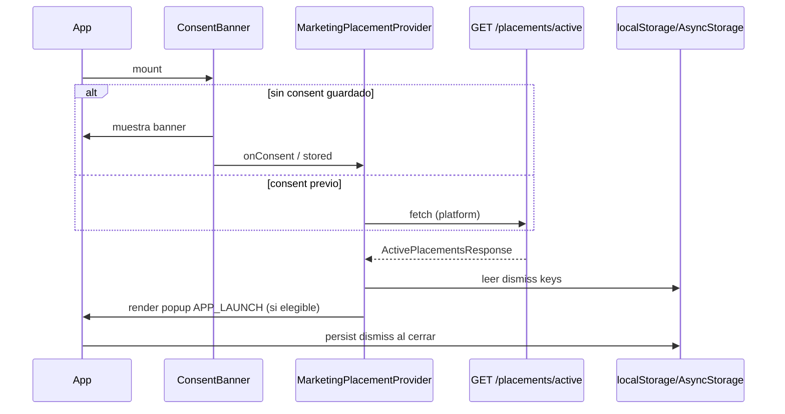

# Diseño: Popups y secciones publicitarias configurables

## Enfoque técnico

Modelo unificado `MarketingPlacement` en Prisma; lógica en `NotificationsModule` (donde ya vive `MarketingController`). API admin + `GET /v1/marketing/placements/active` público con caché Redis e invalidación en mutaciones. Clientes web/mobile consumen vía provider global; popups marketing solo tras consentimiento. Entrega en 4 PRs encadenados (API → Admin → Web → Mobile).

## Decisiones de arquitectura

| Decisión | Alternativas | Elección | Rationale |
|----------|--------------|----------|-----------|
| Módulo NestJS | Nuevo `marketing/` | Extender `NotificationsModule` | `MarketingController` ya está en `notifications/`; evita módulo huérfano y duplicar imports Redis/Prisma |
| Controller | Rutas en controller existente vs separado | Ampliar `MarketingController` | Mismo prefijo `/marketing`; rutas `placements/*` agrupadas bajo tag Swagger existente |
| Caché | Sin caché / CDN | `MarketingPlacementCacheService` (patrón `CatalogCacheService`) | TTL 90s (`MARKETING_PLACEMENT_CACHE_TTL_SECONDS`); clave `marketing:placements:{platform}`; `SCAN`+`DEL` en invalidación |
| Dismiss storage | SecureStore mobile | `localStorage` (web) + `AsyncStorage` (mobile) | Dismiss no es dato sensible; SecureStore reservado para tokens |
| Admin nav | Rutas planas | `MarketingSubNav` + `layout.tsx` | Réplica exacta de `KnowledgeSubNav` / `admin/knowledge/layout.tsx` |
| Componente banner | Solo en apps | `PromoBanner` en `@repo/shared-ui` | RN-web compatible; web usa wrapper Tailwind, mobile usa `PressableCard` + `neo` |
| Hooks api-client | `ops-hooks` vs archivo nuevo | `marketing-hooks.ts` + merge en `hooks.ts` | Separa placements de campañas email; `split-hooks.mjs` actualizado |

## Prisma — `MarketingPlacement`

```prisma
enum MarketingPlacementType { POPUP BANNER PROMO_STRIP }
enum MarketingPlacementSlot { APP_LAUNCH HOME_HERO STORE_TOP STORE_INLINE }
enum MarketingPlacementPlatform { WEB MOBILE ALL }

model MarketingPlacement {
  id                 String   @id @default(uuid())
  name               String   // etiqueta admin
  type               MarketingPlacementType
  slot               MarketingPlacementSlot
  platform           MarketingPlacementPlatform @default(ALL)
  title              String
  body               String?
  imageUrl           String?
  ctaLabel           String?
  ctaHref            String?
  promotionId        String?
  promotion          Promotion? @relation(fields: [promotionId], references: [id], onDelete: SetNull)
  priority           Int      @default(0)
  startsAt           DateTime?
  endsAt             DateTime?
  isActive           Boolean  @default(true)
  contentVersion     Int      @default(1)
  showOncePerSession Boolean  @default(false)
  showOnceEver       Boolean  @default(false)
  dismissible        Boolean  @default(true)
  createdAt          DateTime @default(now())
  updatedAt          DateTime @updatedAt

  @@index([isActive, slot, platform])
  @@index([priority])
  @@index([startsAt, endsAt])
}
```

`Promotion` gana relación opcional `marketingPlacements MarketingPlacement[]`. `contentVersion` se incrementa en PATCH cuando cambian campos visuales (título, body, imagen, CTA).

## API — NestJS

**Archivos nuevos** en `apps/api/src/notifications/`:
- `marketing-placement.service.ts` — CRUD + `resolveActive(platform, slots?)`
- `marketing-placement-cache.service.ts` — get/set/invalidate
- `dto/marketing-placement.dto.ts` — class-validator

**Endpoints** (`MarketingController`):

| Método | Ruta | Auth | Audit |
|--------|------|------|-------|
| GET | `/marketing/placements/active?platform=WEB` | `@Public` | — |
| GET | `/marketing/placements/admin/list` | ADMIN | — |
| GET | `/marketing/placements/:id` | ADMIN | — |
| POST | `/marketing/placements` | ADMIN | `marketing_placement/create` |
| PATCH | `/marketing/placements/:id` | ADMIN | `marketing_placement/update` |
| DELETE | `/marketing/placements/:id` | ADMIN | `marketing_placement/delete` |

**Resolución** (`resolveActive`): filtrar `isActive`, ventana temporal, `platform IN (requested, ALL)`; ordenar `priority DESC, updatedAt DESC`; máx. **1 POPUP** por slot; **N** BANNER/PROMO_STRIP por slot (default sin límite MVP).

**DTOs** (`@repo/shared-types/src/marketing-placement.ts`): `MarketingPlacement`, `CreateMarketingPlacementDto`, `UpdateMarketingPlacementDto`, `ActivePlacementsQuery`, `ActivePlacementsResponse` (mapa `slot → { popup?, banners[], promoStrips[] }`).

**Validación service**: `ctaHref` interno mobile whitelist (`/(tabs)/`, `/product/`, `/store`); `promotionId` debe existir y `isActive` si presente.

## Flujo cliente (consent + popup)



**Web**: `MarketingPlacementProvider` en `providers.tsx`, hijo de `AnalyticsProvider`. Gate: `getStoredConsent() !== null`. Popup: Dialog shadcn con focus-trap y ESC.

**Mobile**: `MarketingPlacementProvider` en `_layout.tsx` tras `AnalyticsConsentBanner`; gate: `hasAnalyticsConsent()`. Popup: `@repo/shared-ui/Modal` con `accessibilityViewIsModal`.

**Dismiss keys**: `marketing:dismissed:{placementId}` (ever) o `:{contentVersion}`; sesión: `sessionStorage` / memoria en provider.

## Admin UI

```
apps/web/src/app/admin/marketing/
├── layout.tsx              # MarketingSubNav
├── page.tsx                # Campañas (existente)
└── placements/
    ├── page.tsx            # SSR prefetch + PlacementsListView
    └── [id]/page.tsx       # PlacementFormView (opcional; o inline modal)
```

`MarketingSubNav`: Campañas (`/admin/marketing`) | Popups y banners (`/admin/marketing/placements`). Formulario: tipo, slot, plataforma, scheduling, prioridad, contenido, flags dismiss, selector promoción (`useMarketingPromotions`), `ctaHref` opcional.

## Web — banners

- `apps/web/src/components/marketing/promo-banner-slot.tsx` — consume context, render por slot
- `apps/web/src/app/page.tsx` — `HOME_HERO` banner + `PROMO_STRIP`
- `apps/web/src/app/store/page.tsx` — `STORE_TOP`, `STORE_INLINE`
- `apps/web/src/lib/public-marketing.ts` — fetch público sin auth (como `public-catalog.ts`)

## Mobile — banners

- `apps/mobile/src/components/marketing/PromoBannerSlot.tsx`
- `(tabs)/index.tsx`, `(tabs)/store.tsx` — slots correspondientes
- CTA: `expo-router` `router.push(ctaHref)` con validación client-side

## api-client

`packages/api-client/src/hooks/marketing-hooks.ts`:
- `useActiveMarketingPlacements({ platform })` — staleTime 60s, queryKey `marketingPlacements.active(platform)`
- `useAdminMarketingPlacements`, `useCreateMarketingPlacement`, `useUpdateMarketingPlacement`, `useDeleteMarketingPlacement`

Regenerar OpenAPI tras PR-1 (`pnpm --filter @repo/api-client generate`).

## shared-ui

`packages/shared-ui/src/PromoBanner.tsx` — props: `title`, `body?`, `imageUrl?`, `ctaLabel?`, `onPress?`, `variant: 'banner' | 'strip'`. Export en `index.ts`.

## Migración y seed

1. `pnpm --filter @repo/api prisma:migrate dev --name add_marketing_placement`
2. Seed en `apps/api/prisma/seed/index.ts` + `constants.ts`:
   - Popup `APP_LAUNCH` / `ALL` → promo Verano 2026 (`IDS.promotionSummer`)
   - Banner `HOME_HERO` / `WEB`
   - Strip `STORE_TOP` / `ALL`
3. IDs fijos en `constants.ts` para demos reproducibles.

## Estrategia de pruebas

| Capa | Qué | Cómo |
|------|-----|------|
| Unit API | `resolveActive`, invalidación caché, bump `contentVersion` | Jest en `marketing-placement.service.spec.ts` |
| Integration API | CRUD + audit + público | supertest en controller spec |
| Web | dismiss + consent gate | Vitest RTL en provider |
| Mobile | provider post-consent | Jest RTL |

## Rollout

Sin feature flag. Desactivar `isActive=false` invalida caché. Revert PRs Mobile→Web→Admin→API.

## Preguntas abiertas

- [ ] ¿Límite máximo de banners por slot en MVP (p.ej. 3) o sin tope?
- [ ] ¿Formulario placement en página dedicada `[id]` o solo modal inline en lista?
