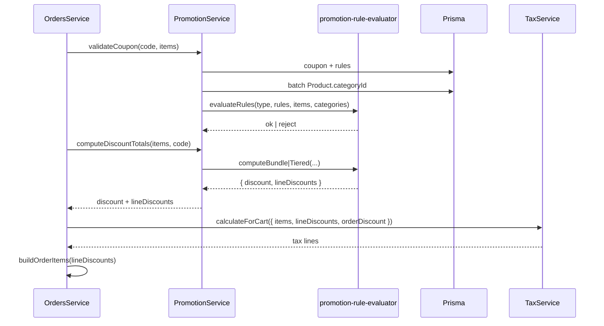

# Design: BUNDLE / TIERED Promotion Engine

## Technical Approach

Implement real checkout semantics for `BUNDLE` and `TIERED` inside `PromotionService` using a new pure helper module (`promotion-rule-evaluator.ts`). Add nullable `discountValue` on `DiscountRule` for multi-rate TIERED tiers. Extend `AppliedPromotion` with per-line discount amounts so `OrdersService` and `TaxService` stop spreading scoped discounts proportionally across unrelated SKUs. Defer full `PromotionEngine` strategy extraction (AGENTS.md) to a follow-up.

Delivery: **3 chained PRs** (`auto-chain`, ~400-line budget each).

## Architecture Decisions

| Decision | Choice | Rejected | Rationale |
|----------|--------|----------|-----------|
| TIERED rates | `discountValue Decimal?` on `DiscountRule`; null → `promotion.value` | No migration (single rate only) | True volume pricing; backward compatible |
| BUNDLE discount | AND all rules; `%` from `promotion.value` on **union** of eligible lines | OR rules, fixed bundle price | Matches admin bundle mental model; no schema change |
| TIERED selection | **Best tier**: sort rules by threshold desc (`minimumQuantity`, then `minimumAmount`); first match wins | Lowest tier, cumulative tiers | Standard escalonada semantics |
| Engine shape | Pure helpers + thin `PromotionService` orchestration | Full `PromotionEngine` port now | Unblocks checkout without scope creep |
| Scoped rules (all types) | Enforce `applicableProductId` / `applicableCategoryId` via batch `Product` lookup | Keep cart-wide only | Fixes silent ignore (e.g. seed `VERANO10`) |
| Line allocation | Engine returns `lineDiscounts[]` aligned to cart items; tax + order items consume it | Keep proportional spread | Prevents mis-allocated tax and `OrderItem.discountAmount` |
| TIERED value type | Percentage only (`discountValue` 0–100) | Per-rule fixed tiers | Out of scope; avoids `valueType` enum |

### BUNDLE semantics (AND)

1. **Global rules** (no `applicableProductId` / `applicableCategoryId`): predicates on full-cart subtotal and total quantity — unchanged preconditions.
2. **Scoped rules**: each rule is a bundle component. `minimumQuantity` defaults to **1** when product/category set and qty omitted.
3. **Validation**: every scoped rule must pass on its eligible lines; failure → `BadRequestException` naming the missing component.
4. **Discount**: when all pass, `discount = round2(unionSubtotal × promotion.value / 100)` where `unionSubtotal` dedupes lines matched by multiple rules.

### TIERED semantics (best tier)

1. Requires ≥1 rule; at least one tier must match or coupon rejected.
2. Sort tiers descending by `minimumQuantity ?? 0`, then `minimumAmount ?? 0`.
3. Evaluate threshold on rule scope (scoped qty or scoped subtotal).
4. First matching tier: `rate = rule.discountValue ?? promotion.value`; apply as **percentage** on that tier's scoped subtotal.
5. Tie-break equal thresholds: `createdAt asc` (stable admin order).

## Data Flow



## File Changes

| File | Action | Description |
|------|--------|-------------|
| `apps/api/prisma/schema.prisma` | Modify | Add `discountValue Decimal?` to `DiscountRule` |
| `apps/api/prisma/migrations/*_discount_rule_discount_value/` | Create | Nullable column migration |
| `apps/api/src/promotions/promotion-rule-evaluator.ts` | Create | Pure helpers: eligibility, scoped metrics, BUNDLE/TIERED eval, line discount map |
| `apps/api/src/promotions/promotion.service.ts` | Modify | Wire helpers; extend `AppliedPromotion`; category batch load |
| `apps/api/src/promotions/promotion.service.spec.ts` | Modify | BUNDLE AND, TIERED best-tier, scoped subtotals, global vs scoped |
| `apps/api/src/promotions/promotions.service.ts` | Modify | BUNDLE/TIERED require ≥1 rule; validate `discountValue` for TIERED |
| `apps/api/src/promotions/dto/promotion-discount-rule.dto.ts` | Modify | `discountValue` optional field |
| `apps/api/src/promotions/promotions.service.spec.ts` | Modify | Admin validation cases |
| `apps/api/src/orders/orders.service.ts` | Modify | Pass `lineDiscounts` to tax + `allocateItemTotals` |
| `apps/api/src/tax/tax.service.ts` | Modify | Optional per-line discounts before proportional loyalty remainder |
| `apps/api/src/tax/tax.service.spec.ts` | Modify | Scoped line discount tax base |
| `packages/shared-types/src/promotion.ts` | Modify | `DiscountRule.discountValue`; optional `lineDiscounts` on result types |
| `apps/web/.../promotion-form.tsx` | Modify | BUNDLE requires `value`; help copy |
| `apps/web/.../promotion-detail-view.tsx` | Modify | TIERED per-rule `discountValue`; ordering hint |
| `apps/web/e2e/promotions-checkout.spec.ts` | Modify | BUNDLE + TIERED checkout scenarios |
| `apps/web/e2e/fixtures/auth.ts` | Modify | `createTestPromotion` BUNDLE/TIERED helpers |
| `openspec/changes/.../specs/promotions-admin/spec.md` | Create (delta) | Checkout semantics for BUNDLE/TIERED |

**Low touch:** `PromotionsController`, api-client (regenerate if OpenAPI changes), web checkout UI (no quote endpoint).

## Interfaces / Contracts

```typescript
// promotion-rule-evaluator.ts
export type LineKey = `${string}:${string}`; // productId:variantId|''

export interface RuleEvalContext {
  items: CartItemInput[];
  categoryByProductId: Map<string, string>;
}

export interface PromotionEvalResult {
  discount: number;
  lineDiscounts: number[]; // same order as items
  freeShipping: boolean;
}

export function evaluateBundle(...): PromotionEvalResult;
export function evaluateTiered(...): PromotionEvalResult;
export function isRuleSatisfied(rule, ctx): boolean;
```

`AppliedPromotion` gains `lineDiscounts?: number[]`. `computeDiscountTotals` forwards them. `CartTaxInput` gains optional `lineDiscounts?: number[]`; promotion discounts applied per-line first; remaining `orderDiscount` (loyalty) still proportional.

## Testing Strategy

| Layer | What | Approach |
|-------|------|----------|
| Unit | Evaluator: AND fail, union subtotal, best tier, category scope | Vitest/Jest table-driven in `promotion.service.spec.ts` |
| Unit | Admin `discountValue` validation | `promotions.service.spec.ts` |
| Unit | Tax with explicit line discounts | `tax.service.spec.ts` |
| E2E | Checkout API with BUNDLE combo + TIERED volume | `promotions-checkout.spec.ts` |

## Migration / Rollout

1. Deploy migration (`discountValue` nullable — existing rows unaffected).
2. **PR-A**: engine + migration + unit tests.
3. **PR-B**: orders/tax line allocation (depends on PR-A types).
4. **PR-C**: admin UI + E2E.

**Breaking change:** scoped `applicableCategoryId` / `applicableProductId` rules now enforce at checkout (document in release notes).

## Open Questions

- [ ] None blocking — fixed-amount TIERED tiers deferred.
